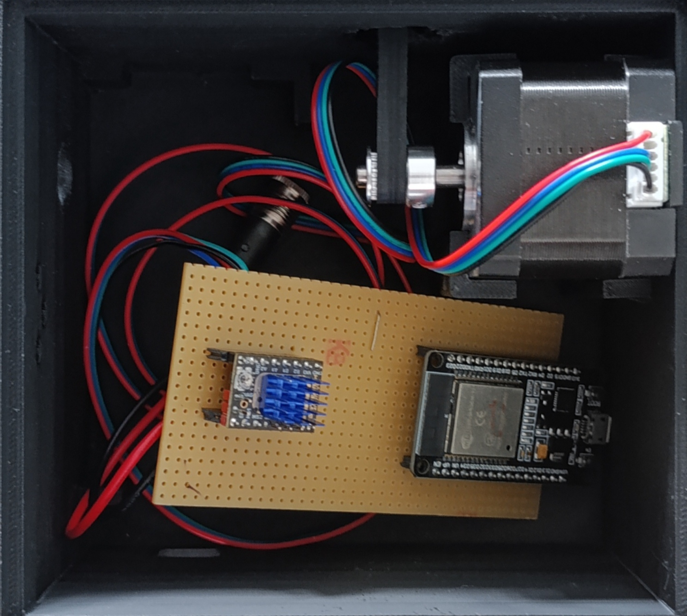
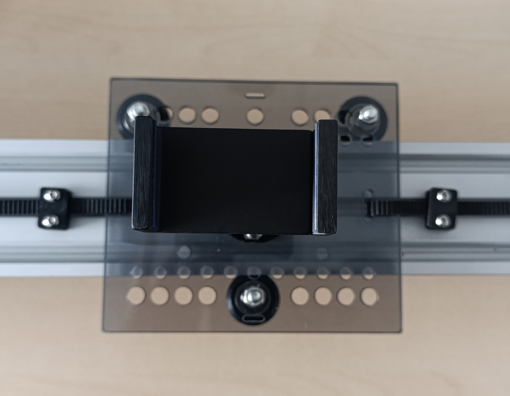
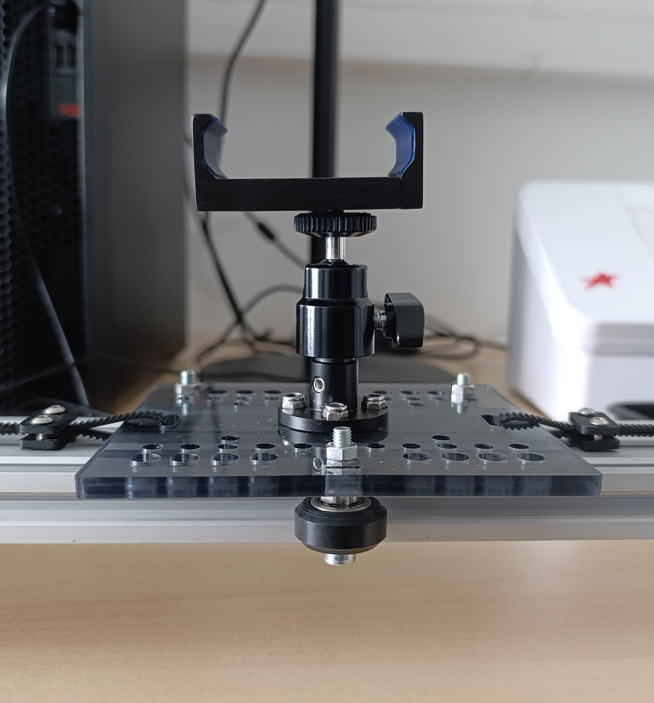
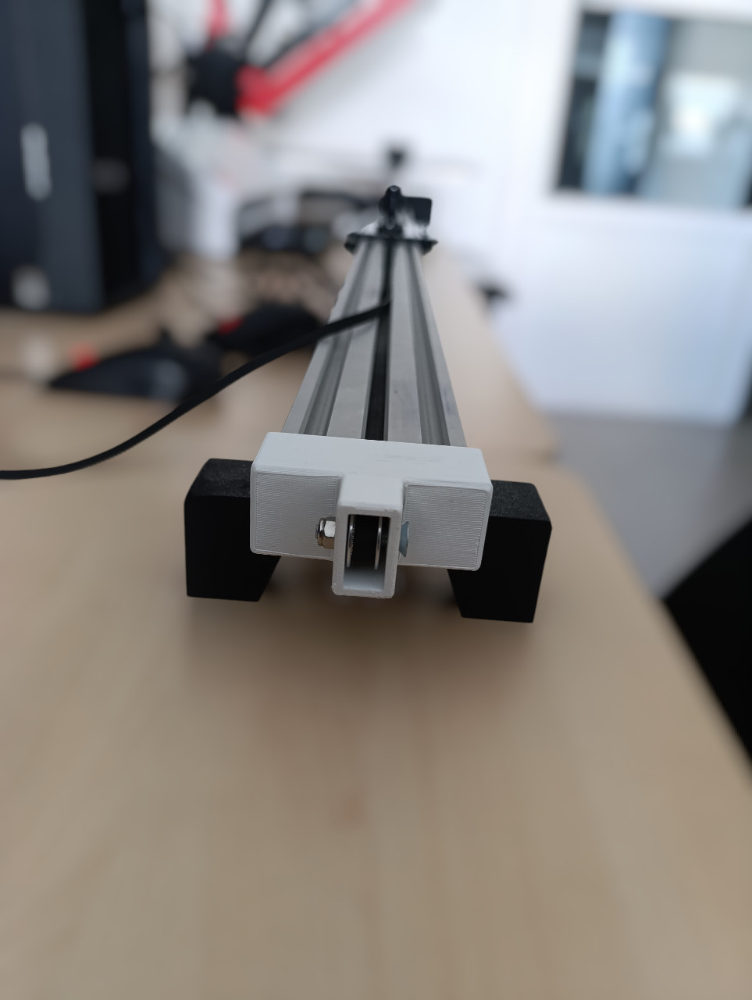

# Assemblage

Une fois les matériaux préparés, l’étape suivante consiste à assembler les différentes pièces.
Pour mieux illustrer cette phase, voici des photos de notre prototype assemblé, accompagnées de quelques explications.

Ce boîtier contient l’ensemble des composants électroniques :
- la carte ESP32-WROOM,
- le driver TMC2209,
- l’alimentation,
- ainsi que le moteur pas à pas.
Les composants sont soudés ensemble et organisés de manière compacte.
Des ouvertures ont été prévues dans le boîtier : pour laisser passer la courroie de chaque côté, et pour permettre de connecter un câble USB à l’ESP32.

Sur le plateau mobile, on retrouve :
- un support universel pour caméra,
- les roues V-Slot, montées à l’aide de vis et entretoises excentriques, pour un ajustement précis,
- la courroie, fixée aux deux extrémités du plateau pour permettre la traction.

À l’extrémité opposée du moteur se trouve un carter de fin de rail.
Ce carter a deux fonctions :
- Empêcher le plateau de sortir du rail,
- Maintenir en place une poulie, qui permet de retourner la courroie vers le plateau. 

