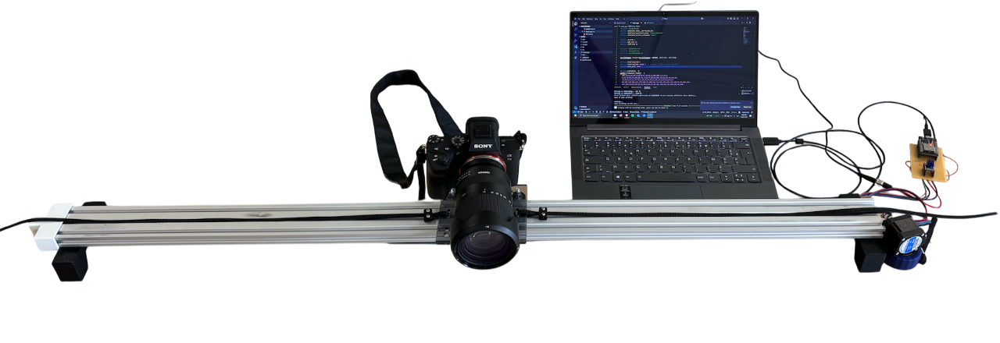
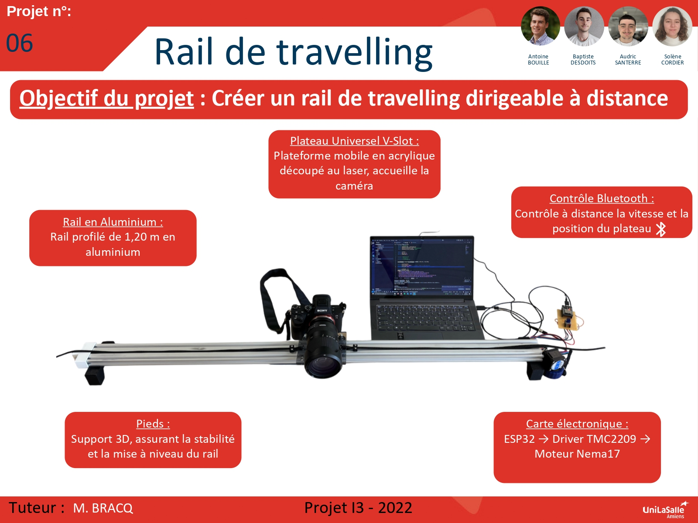

# Bienvenue sur notre documentation

Bienvenue dans la documentation du projet de rail de travelling. Ce site a pour but de fournir toutes les informations nécessaires pour comprendre, utiliser et reproduire efficacement notre projet.
Passionnés de photographie et vidéo, ce projet nous a tout de suite semblé inévitable. Le travelling est une technique de plan important dans le cinéma et le rail de travelling permet d'innover dans notre façon de filmer. Le rail de travelling aura pour objectif d'être utilisé au MediaLab d'Unilasalle Amiens. 

## À propos du Projet
Ce projet vise à concevoir et fabriquer un **rail de travelling motorisé** destiné au **MédiaLab**, ou dans d'autres domaines comme le **cinéma** ou la **prise de vidéo amateur**.  
Cet équipement permettra d'améliorer la qualité des productions audiovisuelles en offrant des mouvements de caméra **précis, fluides et reproductibles**.  

Un **rail de travelling motorisé** permet :  
- D'obtenir des **mouvements fluides et stabilisés**, sans à-coup.  
- De **faciliter la répétition d’un mouvement**, utile pour les effets visuels et les prises de vue synchronisées.  
- D’**automatiser certaines prises**, améliorant ainsi la qualité des vidéos.  

Le rail étant **accessible et facile d'utilisation**, il ne vise pas uniquement les professionnels.  
Toute personne souhaitant réaliser des vidéos ou en ayant l'utilité peut l'utiliser.
   

## Poster

Vous pouvez trouver ci_dessous, le poster de notre projet. 

## Vidéo

<video controls width="700">
  <source src="https://cloudlasalle-my.sharepoint.com/personal/audric_santerre_etu_unilasalle_fr/_layouts/15/stream.aspx?id=%2Fpersonal%2Faudric%5Fsanterre%5Fetu%5Funilasalle%5Ffr%2FDocuments%2FPi%C3%A8ces%20jointes%2FVide%CC%81o%5FProjet%5FI3%2Emp4&ct=1749739647055&or=OWA%2DNT%2DMail&cid=b2ef88b5%2D9221%2D3a18%2Dbbba%2D4811b066ca94&ga=1&referrer=StreamWebApp%2EWeb&referrerScenario=AddressBarCopied%2Eview%2E927cef4f%2D03f2%2D4de2%2Da649%2Dad48cf5ec798" type="video/mp4">
</video>

<video src="images/intro_amiens.mp4" controls title="Title"  style="width: 100%;"></video>

---
